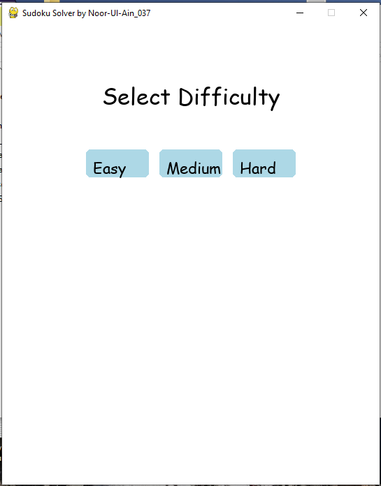
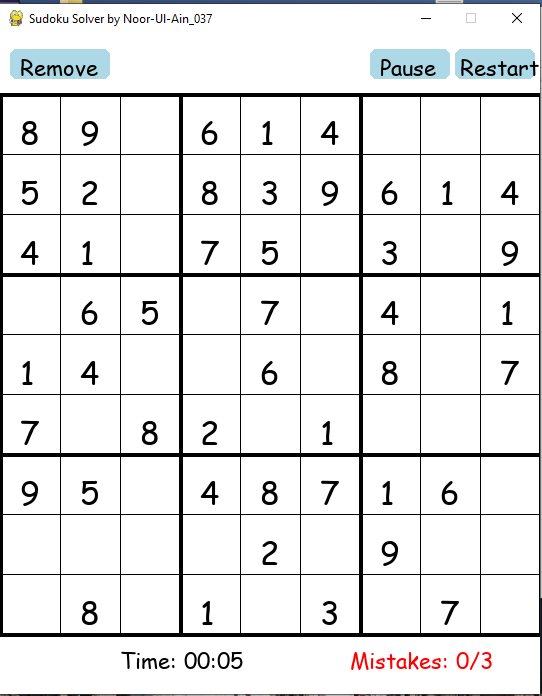

# Sudoku Solver 🎲

A GUI-based Sudoku Solver built in Python with Anaconda.  
It allows users to play Sudoku and automatically solve puzzles.

## Features
- Sudoku solving with backtracking
- Interactive GUI (`sudoku_solver_gui.py`)
- Sound effects on win/lose
- Leaderboard tracking
- Conda environment support (`environment.yml`)

## Installation & Setup

### 1. Clone the Repository
```bash
git clone https://github.com/Noorulain037/SUDOKU_SOLVER.git
cd SUDOKU_SOLVER

## 2. Create & Activate Conda Environment
conda env create -f environment.yml
conda activate sudoku_solver

## 3. Run the Game

python sudoku_solver_gui.py

## 4. Project Structure

sudoku_solver_gui.py → Main GUI program

generate_sounds.py → Script to generate game sounds

leaderboard.py → Handles leaderboard logic

leaderboard.json → Stores player scores

correct.wav, wrong.wav, win.wav → Sound effects

environment.yml → Conda environment setup file

SUDOKUSOLVER.txt → Notes file

## 5. Author

Developed by Noorulain037
GitHub: Noorulain037

## 🖼️ Screenshots
Here’s how the Sudoku Solver looks in action:

### Game Window


### Solved Puzzle


